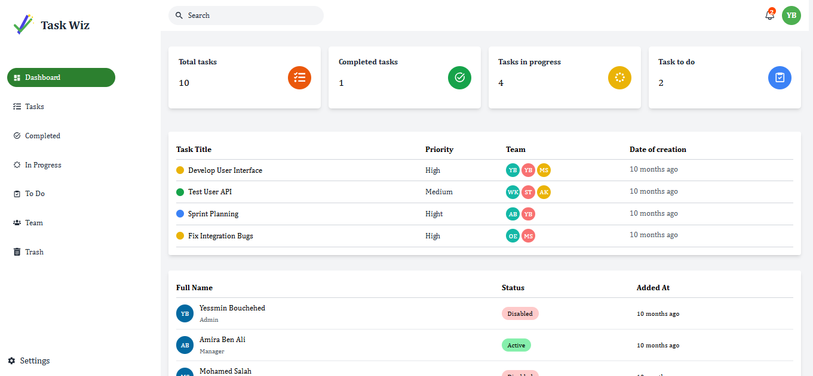
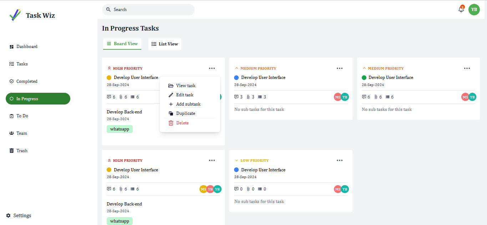
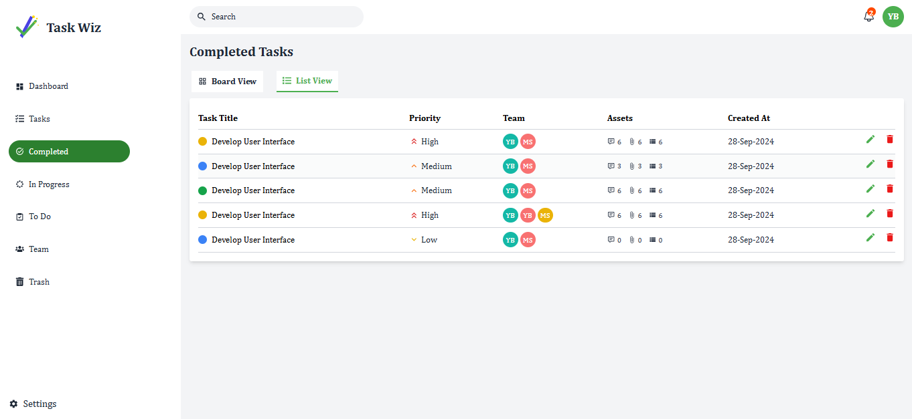
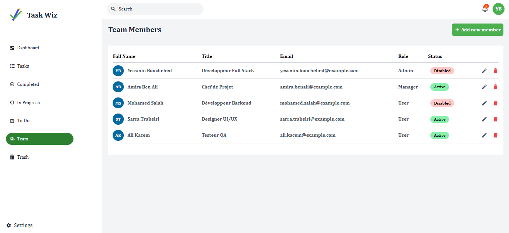
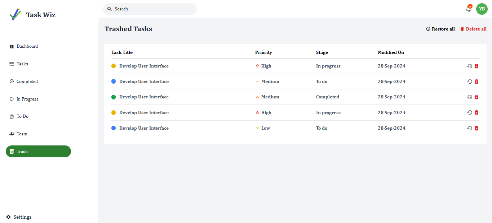

# Dashboard React avec Tailwind CSS

Ce projet est un tableau de bord (Dashboard) développé en React et stylé avec Tailwind CSS.  
Il utilise plusieurs bibliothèques modernes dont Redux Toolkit, React Router, React Hook Form, Recharts, et d'autres.

---

## Technologies utilisées

- React 18
- Tailwind CSS
- @headlessui/react
- Redux Toolkit
- React Router DOM v6
- React Hook Form
- Recharts (pour les graphiques)
- React Icons
- Sonner (notifications)
- Moment.js (gestion des dates)
- clsx (gestion des classes conditionnelles)

---

## Aperçu des interfaces

### 1. Dashboard - Vue principale

Cette interface affiche le résumé des tâches, leur état (terminé, en cours, à faire), ainsi que des statistiques globales.

---

### 2. Liste des tâches (Tasks)

Cette interface permet de visualiser toutes les tâches avec leurs priorités, équipes assignées et dates de création.

---

### 3. Équipe (Team)

Page listant les membres de l’équipe avec leurs rôles, statut et date d’ajout.

---

### 4. Corbeille (Trash)

---

